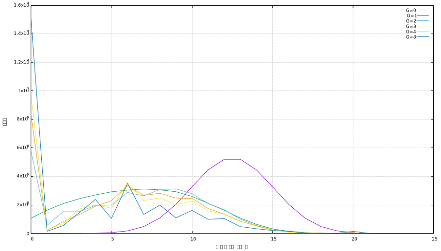
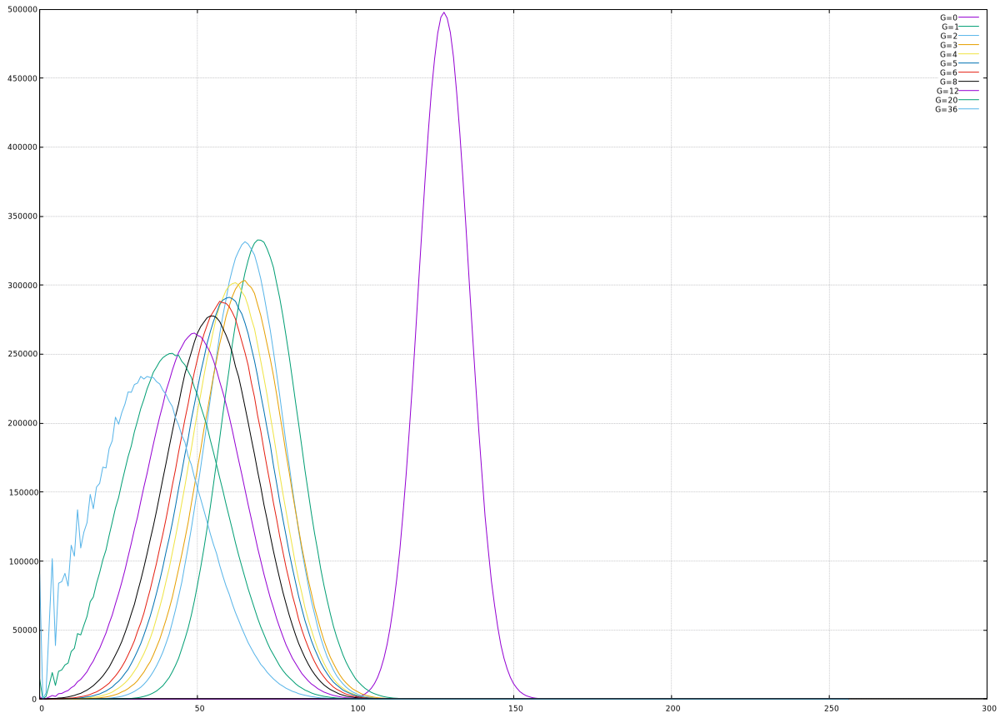
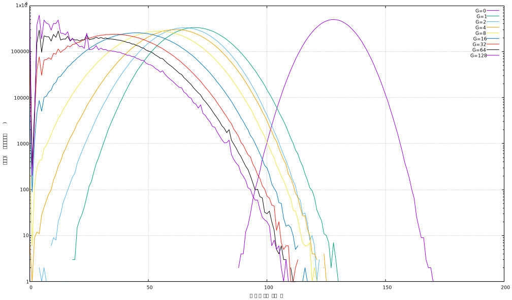

# Life Game Distribution

2次元の周期境界 `N*N` 正方格子で Conway's Game of Life の色々を計算する。

## back_count

「G世代後にその盤面に至っている盤面はいくつか？」

例:

```
$ ./target/release/back_count 4 10
1 672
2 128
5 16
7 32
9 16
15 128
21 128
24 64
31 8
53 32
347 4
348 16
49116 1
```

1. `4*4` の全ての盤面を10世代進める
2. その10世代後に存在する盤面毎に「いくつの初期盤面からきたか」を数えてそれを `M` とする
3. `M` 毎にいくつあるか数える

つまり上の `4*4` で10世代だと

* ただ一つの盤面からしかこない盤面が672個ある
* 49116個の盤面から到達する盤面が1つある（確かめていないが全滅のパターンのはず）

のように解釈する。

## next_generation_lives_dist/next_generation_lives_random_dist

「G世代後に生き残っているセルの数でヒストグラムを作る」

`next_generation_lives_dist` が全探索、 `next_generation_lives_random_dist` がランダム初期値サンプリング。

### `5*5`

`5*5` で横軸を「G世代後に生き残っているセルの数」、縦軸を「盤面数」として分布を書くと↓のようになる。



* `G=0` での分布は普通
* `G=1` は滑らかに死に絶える方に推移している
* `G=2` 以降は全滅する割合がすごく多い、一方 `x=20` あたりにもピークが現れる

`x=20` は例えば↓のような初期値から

```
##..#
.##..
#....
.....
.....
```

最終的に↓となっている。

```
##.##
#.###
.####
####.
###.#
```

ライフゲームは普通は周期境界じゃない気がするのでそのせいだろうか？

### `16*16`

10^7 サンプルしている(2h28mかかった)。
盤面のサイズが大きくなると様相がだいぶ違う。



片対数グラフにするとそれぞれがほとんど正規分布であることがわかる。
`5*5` で見られた生き残りが多い領域の異常なピークはなさそう。


